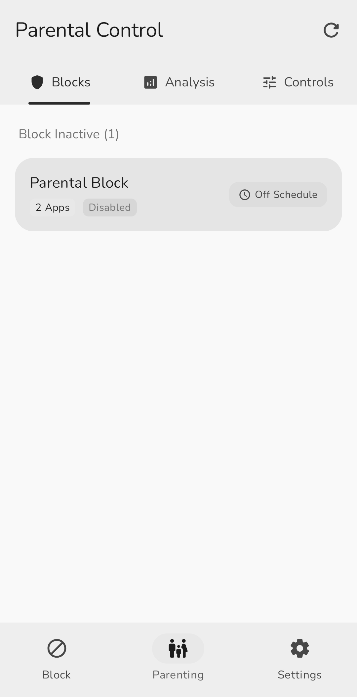
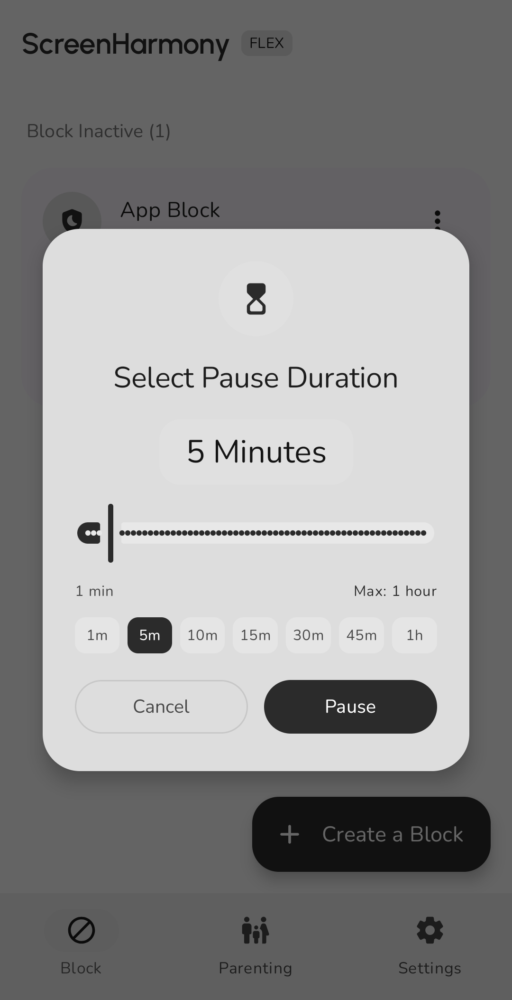
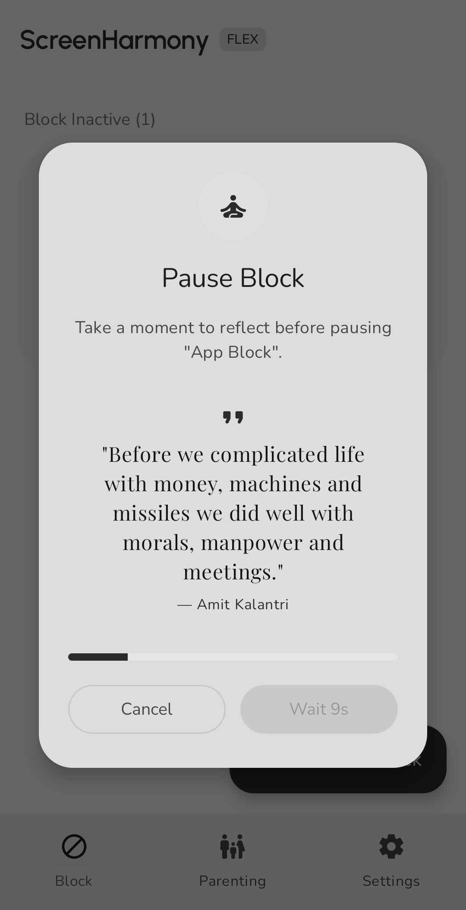
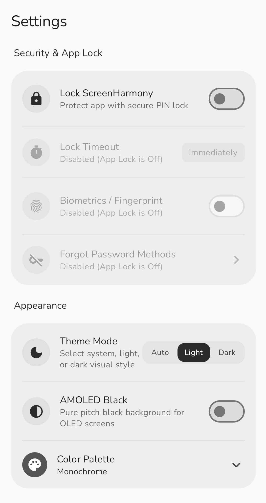

# Screenshots

Visual walkthrough of ScreenHarmony Flex user interface, block configurations, pause challenges, parental controls, and personalization.

---

## # Index
- [Blocks Dashboard](#-blocks-dashboard)
- [Weekly Schedule Planner](#-weekly-schedule-planner)
- [Zero-Flicker Lock Screen](#-zero-flicker-lock-screen)
- [Self Block & App Selection](#-self-block--app-selection)
- [Child Device Panel](#-child-device-panel)
- [Pause Duration Slider](#-pause-duration-slider)
- [Mindfulness Pause Quote](#-mindfulness-pause-quote)
- [Personalization & Settings](#-personalization--settings)

---

## # Blocks Dashboard

Overview of active, paused, and scheduled block rules with real-time status indicators.

  

---

## # Weekly Schedule Planner

Integrated 24-hour canvas timeline graph for configuring custom day combinations and active blocking hours.

  

---

## # Zero-Flicker Lock Screen

Instant system overlay lock wall with countdown timer, mindfulness quotes, and distraction barriers.

  

---

## # Self Block & App Selection

Fine-grained rule setup supporting app discovery, browser domain interception, delay sliders, and strict enforcement.

  

---

## # Child Device Panel

Parental dashboard displaying live child telemetry, battery health, screen state, and remote device lock controls.

  

---

## # Pause Duration Slider

Customizable countdown delay challenges preventing impulsive unpausing routines.

  

---

## # Mindfulness Pause Quote

Motivational quote prompts and friction challenges designed to promote intentional device usage.

  

---

## # Personalization & Settings

Custom themes featuring 7 Material 3 color palettes, dark mode, and pitch-black AMOLED styling.

  

---

Copyright © 2026 Subham Kumar Sathua. Licensed under the Apache License 2.0.
