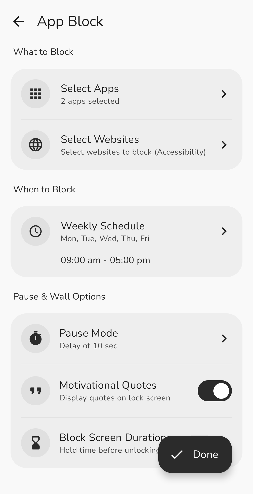
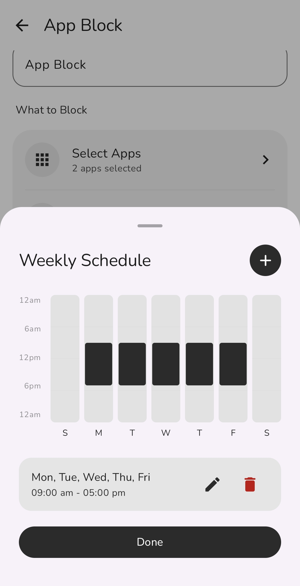
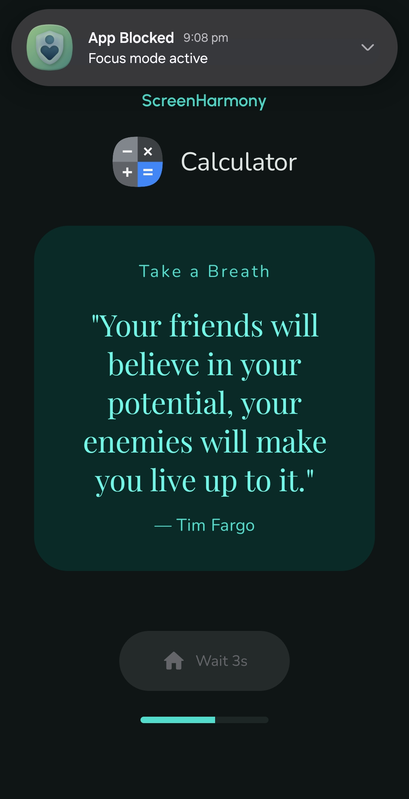
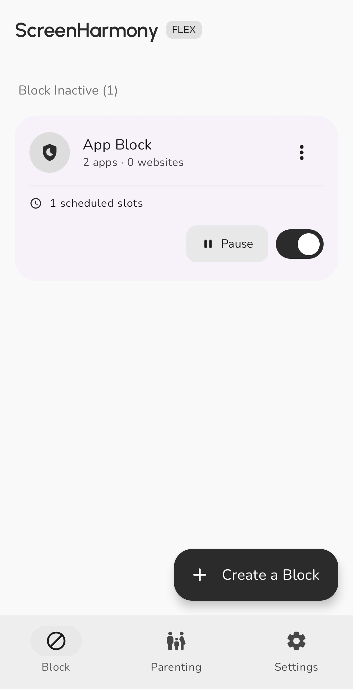

# ScreenHarmony Flex

**Block distracting apps and websites with real-time parental control and family synchronization on Android.**

ScreenHarmony Flex enforces digital wellbeing, focused productivity, and tamper-resistant parental supervision. It combines usage-access foreground monitoring, browser domain inspection, instant remote screen locking, and anti-tamper safeguards to maintain distraction-free focus routines across devices.

**Use Case:**
Individuals and parents need dependable focus enforcement that cannot be easily bypassed. ScreenHarmony Flex delivers zero-flicker lock screens, cross-device Family Sync for remote control, scheduled blocking routines, and self-healing permission guards without draining battery or tracking personal data.

---

## # Index
- [Features](#-features)
- [Screenshots](#-screenshots)
- [How to install](#-how-to-install)
- [How to contribute](#-how-to-contribute)
- [Requirements](#-requirements)
- [Troubleshooting](#-troubleshooting)
- [License & Legal](#-license--legal)
- [Privacy Policy](#-privacy-policy)
- [Links](#-links)
- [Contact](#-contact)

---

## # Features
- **App Blocking:** Intercept launchable packages in real time using UsageStatsManager and system overlay layers.
- **Website Filtering:** Inspect browser address bars dynamically across Chrome, Firefox, Brave, Opera, and Samsung Internet.
- **Remote Device Lock:** Lock child device screens on demand from the parent dashboard via Accessibility actions.
- **5-Vector Anti-Tamper:** Shield against uninstallation, force stop, storage clearing, and permission revocation on child devices.
- **Auto-Healing Permissions:** Detect and automatically re-enable critical permissions if turned off in system settings.
- **Cross-Device Family Sync:** Synchronize live battery status, screen state, and block rules in real time via Firebase.
- **Visual Schedule Planner:** Configure active hours and weekly schedules with a 24-hour visual canvas graph.
- **Strict & Delay Modes:** Prevent impulsive unpausing using countdown delay timers, typing challenges, or unbreakable strict sessions.
- **Material 3 Expressive UI:** Personalize with 7 curated color palettes, dynamic system recoloring, and pitch-black AMOLED mode.

---

## # Screenshots

> **Full Gallery:** [View all high-resolution screenshots](.github/assets/screenshots/SCREENSHOTS.md)

<p align="center">
  
  
</p>

<p align="center">
  
  
</p>

---

## # How to install

> **Download:** [Get the latest release here](https://github.com/SubhamSathua/screen-harmony-flex/releases)

1. **Download APK:** Select the APK matching your device from the latest release:
   - `app-arm64-v8a-release.apk` (Recommended for modern smartphones).
   - `app-universal-release.apk` (Universal installer for all devices).
2. **Install:** Open the downloaded APK on your Android phone and tap Install.
3. **Grant Required Permissions:**
   - **Usage Access:** Allows the app to detect foreground applications.
   - **Display Over Other Apps:** Enables full-screen lock walls over restricted apps.
   - **Accessibility Service:** Enables browser website filtering, anti-tamper protection, and remote lock execution.
   - **Battery Optimization:** Disables background throttling for continuous protection.
4. **Choose Mode:** Select **Self Mode** for personal productivity or **Family Mode** to pair Parent and Child devices using a 6-character code or QR scan.

---

## # How to contribute
We welcome contributions to ScreenHarmony Flex. Follow these steps to set up your local development environment:

1. **Clone the Repo:**
   ```bash
   git clone https://github.com/SubhamSathua/screen-harmony-flex.git
   ```
2. **Open in Android Studio:**
   - Open Android Studio (Ladybug 2024.2+ or newer).
   - Let Gradle sync project dependencies.
3. **Set Up Firebase Config:**
   - Copy `app/google-services.json.example` to `app/google-services.json`.
   - Add your Firebase project credentials.
4. **Build APK:**
   ```bash
   # Build Debug APK
   .\gradlew.bat assembleDebug

   # Build Signed Release APKs (Universal & ABI-split)
   .\gradlew.bat assembleRelease
   ```

---

## # Requirements
- **Operating System:** Android 7.0 (API Level 24) or higher.
- **Target SDK:** Android 15 / 16 (API Level 36).
- **Architecture:** ARM64-v8a, ARMv7, x86_64, or x86.
- **Development Tooling:** Android Studio Ladybug+, JDK 17 or JDK 21, Kotlin 2.0+.

---

## # Troubleshooting
- **Lock Screen Not Appearing:** Ensure both "Usage Access" and "Display Over Other Apps" permissions are active in device settings.
- **Website Blocking Inactive:** Verify that the "ScreenHarmony" Accessibility Service is enabled under Settings > Accessibility.
- **Background Service Killed:** Disable aggressive battery optimization for ScreenHarmony in system battery settings.
- **Family Sync Connection Failed:** Confirm that both Parent and Child devices have active internet access to reach Firebase.

---

## # License & Legal
This project is licensed under the **Apache License 2.0**.

**Liability Protection:** The author provides this software "as is" without warranties. By using this software, you agree that the author is not liable for any damages, data loss, or system issues resulting from its use.

**Modifications:** If you modify and distribute this software, you must:
1. Retain all original copyright notices.
2. Include a copy of the Apache License.
3. Protect the original author from any liability claims arising from your modified version.

---

## # Privacy Policy
- **On-Device Data Processing:** App usage history and browser navigation are inspected entirely in memory on your physical device.
- **Zero Personal Data Collection:** No browsing history, personal files, passwords, or keystrokes are stored or transmitted.
- **Anonymous Family Sync:** Device pairing uses random UUIDs and isolated family channels without requiring personal email or phone numbers.
- **No Third-Party Advertising:** Zero ad SDKs, zero user tracking, and zero telemetry brokers.

---

## # Links
- [Report an Issue](https://github.com/SubhamSathua/screen-harmony-flex/issues) - Report bugs and request new features.
- [Security Policy](SECURITY.md) - Guidelines for reporting security vulnerabilities.
- [Apache 2.0 License](LICENSE) - View the full license terms.

---

## # Contact
**Author:** Subham Kumar Sathua
**GitHub:** [@SubhamSathua](https://github.com/SubhamSathua)
**Repository:** [screen-harmony-flex](https://github.com/SubhamSathua/screen-harmony-flex)

---
Copyright © 2026 Subham Kumar Sathua. Licensed under the Apache License 2.0.
